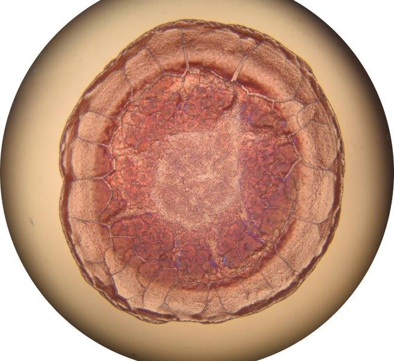

# BloodDroplet
Extracting BloodDroplets from Images

## Getting Started

These instructions will get you a copy of the project up and running on your local machine for you to test the algorithms on your own images.
<br><br>
### Preprocessing
___
The main idea is to use Extract and Trim exact blood droplet portion from the image, then pad them so that it will fit perfectly. 

And also to create multiple versions of each image varying by size, mask and Binary inversion.
#### Prerequisites

You must have OpenCV, NumPy, Libraries installed.
```
$ pip install opencv-python==4.5.2.54
```
```
$ pip install numpy==1.21.0
```

#### Usage
Put your images in INPUT Directory and Run `main.py`. 

- [x] **NOTE:**  I'm working on it's accuracy, because it's producing false results for some images, I will push updates soon

Assuming that your INPUT images are in folders `INPUT/` and it will write all the outputs in `OUTPUT/` folder respectively.


#### Advance Usage
You can simply use preprocess function in your code with two parameters example given below
```
from main import process_image
process_image("input_dir_path", "output_dir_path")
```

This will preprocess all the images into `output_dir_path`.

<br><br>

#### Sample Input and Output
<p align="center">
  
  
</p>